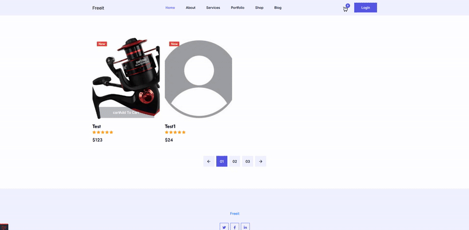

# 🛒 Laravel E‑commerce App

[](#)
[](#)
[](#)
[](#)
[](#)
[](#)
[](#)

A production‑ready **e‑commerce** application built with **Laravel 12** and **PHP 8.2+**.  
It features a public product catalog, product detail pages, a session‑based shopping cart, and an authenticated dashboard for product management. The project follows modern Laravel architecture with a focus on scalability, performance, and clean code.

---

## ✨ Features
- Public product catalog & detail pages
- 🛒 **Full cart system** (add, remove, update quantity, persistent session)
- Admin dashboard for product CRUD
- Authenticated and verified routes (Laravel Breeze)
- Flash notifications with PHPFlasher/Notyf
- PSR‑12 code style with Laravel Pint
- Real‑time logging via Laravel Pail
- Optional Docker setup (Laravel Sail)
- Developer‑friendly testing with Pest
- Debugbar integration for local development

---
## 🎥 Demo



---

## 🛒 Cart System
A complete cart module built using Laravel sessions, ensuring smooth user experience even without authentication.

**Key Features:**
- Add, remove, and update items dynamically  
- Automatic subtotal & total price calculation  
- Session-based persistence for guest users  
- Integrated with product color & image variations  
- Compatible with authenticated checkout flow (future roadmap)  

Controllers involved:
- `AddToCartController`
- `CartPageController`
- `ProductController` (for admin sync)

---

## 🛠 Tech Stack
- **Framework:** Laravel 12
- **Language:** PHP 8.2+
- **Auth:** Laravel Breeze (Blade + Tailwind)
- **UI/UX:** Notyf (PHPFlasher integration)
- **Database:** MySQL (default), SQLite (dev)
- **Storage:** Local `public/uploads`, S3-ready
- **Tooling:** Pest, Pint, Pail, Sail, Debugbar

---

## ⚙️ Installation
```bash
git clone https://github.com/DevAliG/laravel-ecommerce.git
cd laravel-ecommerce
composer install
npm install
cp .env.example .env
php artisan key:generate
```

### Database Setup
Configure your `.env`:
```
DB_CONNECTION=mysql
DB_HOST=127.0.0.1
DB_PORT=3306
DB_DATABASE=ecommerce_app
DB_USERNAME=root
DB_PASSWORD=your_password
```
Then run migrations:
```bash
php artisan migrate
```

### Filesystem & Media
Product media stored in:
```
public/uploads/products
```
To use Laravel’s storage link:
```bash
php artisan storage:link
# Set FILESYSTEM_DISK=public in .env if needed
```

### Run (Development)
```bash
php artisan serve
npm run dev
```

---

## 🧱 Architecture Overview
- **Controllers:** `ProductPageController`, `ProductController` (admin), `AddToCartController`, `CartPageController`, `ProfileController`
- **Requests:** `ProductStoreRequest`, `ProfileUpdateRequest`
- **Models:** `Product`, `ProductImage`, `ProductColor`, `User`
- **Routing:** Public (catalog, cart) + Authenticated (dashboard, product CRUD)
- **Auth:** Login, reset, verification via Laravel Breeze (registration disabled by default)

---

## 🧪 Tests & Code Quality
```bash
php artisan test          # or: ./vendor/bin/pest
./vendor/bin/pint         # format code style
php artisan pail          # live log viewer
```

---

## 🔒 Security Notes
- Registration disabled by default
- `.env` must never be committed
- CSRF protection and validation included
- Authenticated admin-only access for product management
- FormRequests used for input sanitization

---

## 🚀 Roadmap
- [x] Product catalog, details, cart
- [x] Admin product CRUD
- [x] Auth (login, reset, verify)
- [x] Notifications (Notyf)
- [ ] Checkout & order flow
- [ ] Payment integration
- [ ] Inventory tracking
- [ ] Image optimization & CDN
- [ ] CI/CD pipeline setup

---

## 👤 Author
**DevAliG (Ali Ghanbarzadeh)**  
SaaS & MVP Builder | Tech Content Creator

[LinkedIn](https://www.linkedin.com/in/devalig) • [GitHub](https://github.com/DevAliG)

---

## 📄 License
MIT
